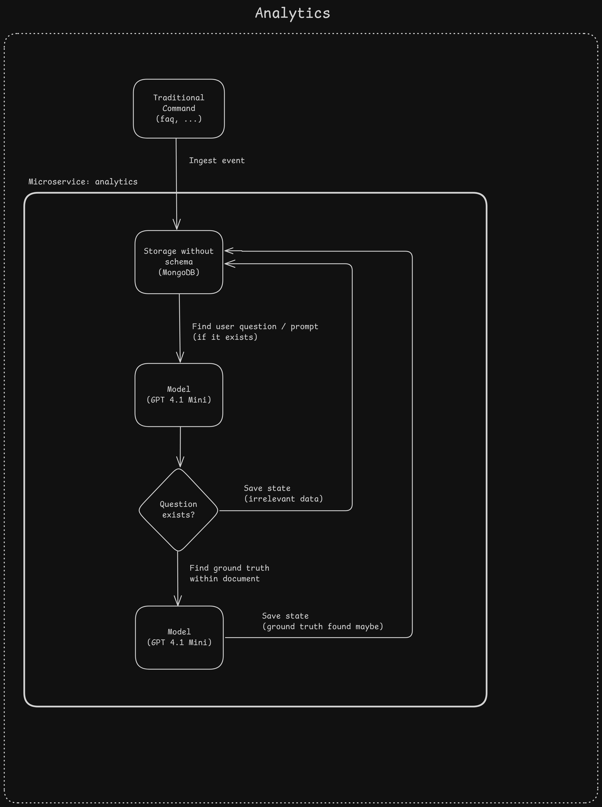

# Documentation

This application is for collecting various analytics data from [`finki-discord-bot`](https://github.com/finki-hub/finki-discord-bot) usage. At the time of writing, it collects some data about various informational commands.

Uses [`FastAPI`](https://github.com/fastapi/fastapi) for exposing endpoints and [`MongoDB`](https://github.com/mongodb/mongo) for data storage. It was chosen over a relational database due to the fact that the analytics events are unstructured and come as JSON objects with differing schemas and data inside.

The events originate from [`finki-discord-bot`](https://github.com/finki-hub/finki-discord-bot). This app exposes `/events/ingest` for ingesting and `/events/{event_name}` for querying events with options for filtering.

## Pipeline

1. On command execution, collect data and send it to this (analytics) service
2. Save the event in DB
3. Queue the event for further analysis using a background worker
4. If the event is not an FAQ event, terminate here, otherwise continue to the next step
5. In the message context of the event, using an LLM, find the relevant user question
6. If there is no user question, terminate here, otherwise continue to the next step
7. Given the user question, try to find the correct answer (ground truth) within the document
8. If there is no correct answer, terminate here, otherwise continue to the next step
9. In the existing event, save also the user question and correct answer to DB

The events are now available for querying and filtering. The FAQ events with identified questions and answers are used further for evaluating LLMs.

## Pipeline visualization

